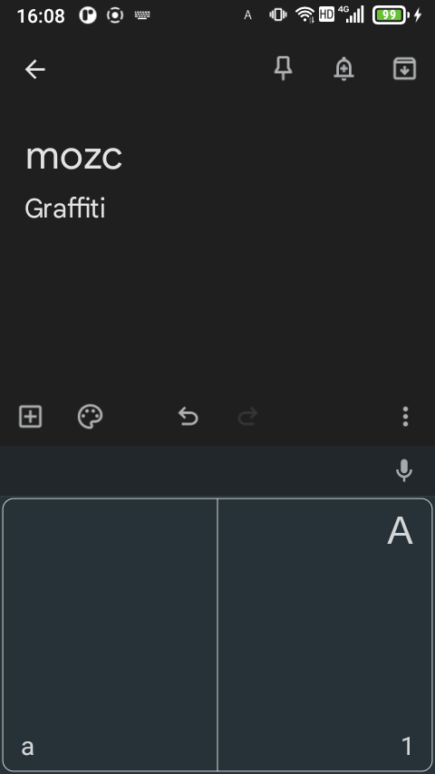
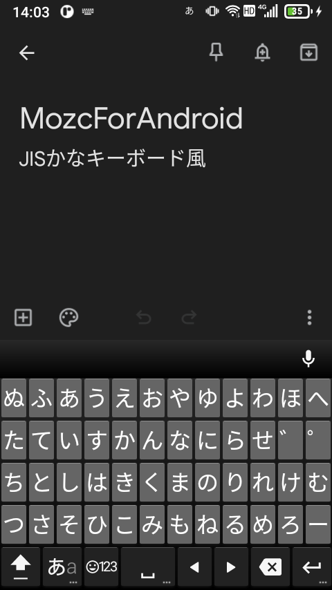
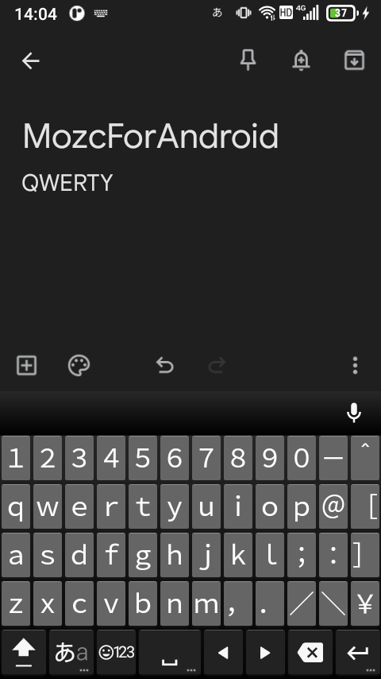
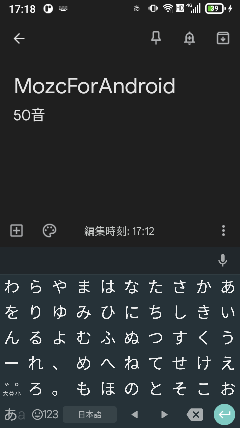
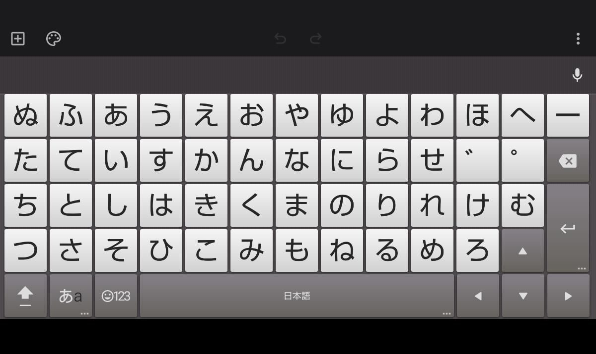

# Mozc for Android
Mozc for Android バージョン 2.23.2815.103-arm64 をベースにしてキーボードを追加しています。

辞書の再構成やpicファイルの追加に関しては
[Mozc for Android用mozcのWiki](https://github.com/kachaya/mozc/wiki)
を参照してください。

ストローク入力での操作
* 日英切り替えは「左下→右上」のストローク
* 絵文字等のシンボル入力は「左上→右下」のストローク
* オプションメニュー表示は「左下→右上→左下」のストローク

ビルド済みバイナリはこちら→[apkファイル](./MozcForAndroid.apk)
